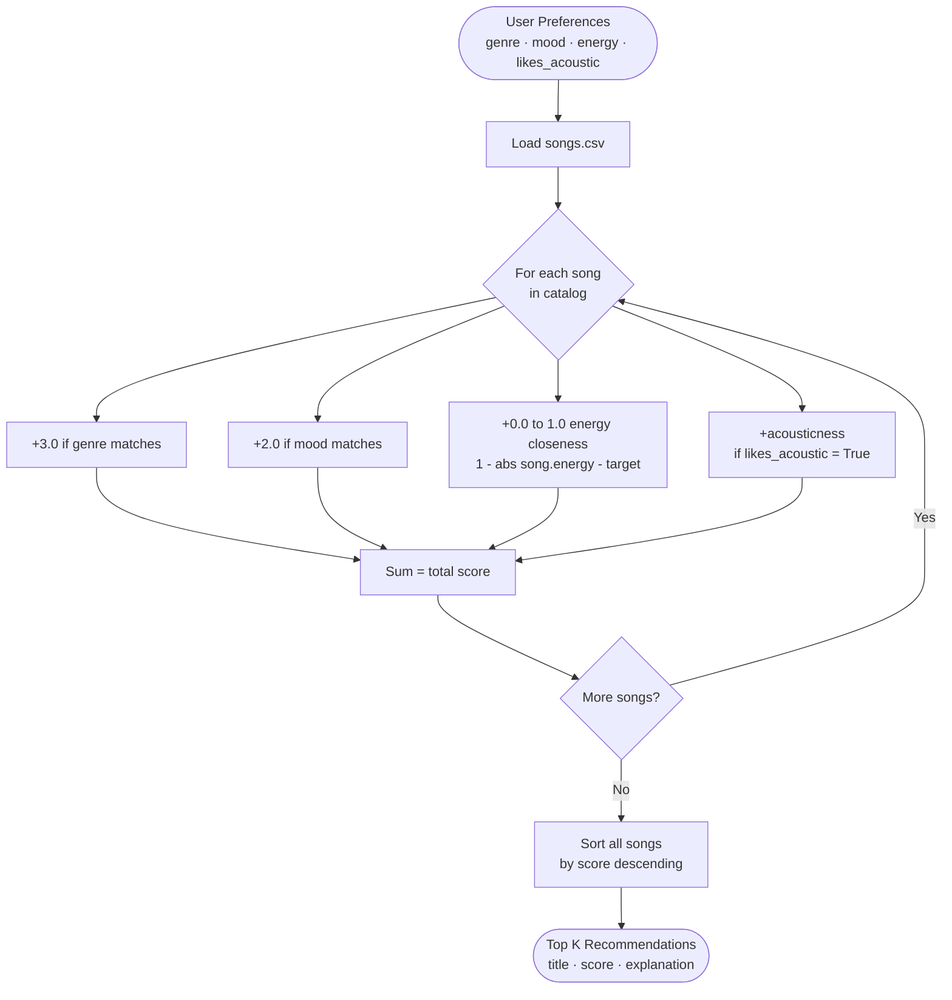
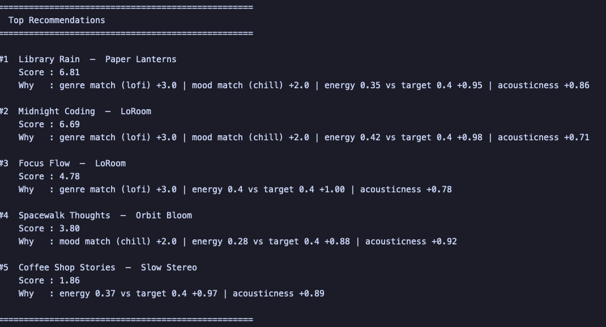

# 🎵 Music Recommender Simulation

## Project Summary

In this project you will build and explain a small music recommender system.

Your goal is to:

- Represent songs and a user "taste profile" as data
- Design a scoring rule that turns that data into recommendations
- Evaluate what your system gets right and wrong
- Reflect on how this mirrors real world AI recommenders

Replace this paragraph with your own summary of what your version does.

---

## How The System Works

Real-world recommenders like Spotify or YouTube learn from listening history, skips, and likes to find patterns across millions of users and songs. This version takes a simpler, transparent approach called content-based filtering: it compares what a user says they want directly against the measurable features of each song. It prioritizes clarity over complexity — genre and mood are the strongest signals, with energy used as a continuous tie-breaker based on closeness to the user's target value.

Explain your design in plain language.

Some prompts to answer:

- What features does each `Song` use in your system
  - For example: genre, mood, energy, tempo
  - Each `Song` stores: `genre`, `mood`, `energy` (0–1), `tempo_bpm`, `valence`, `danceability`, and `acousticness` (0–1). The most useful for scoring are genre, mood, energy, and acousticness.
- What information does your `UserProfile` store
  - `UserProfile` stores: `favorite_genre`, `favorite_mood`, `target_energy` (a float between 0 and 1), and `likes_acoustic` (a boolean).
- How does your `Recommender` compute a score for each song
  - It adds up points: +3.0 if genre matches, +2.0 if mood matches, +(1 - |song.energy - user.target_energy|) for energy closeness, and +song.acousticness if the user likes acoustic sound.
- How do you choose which songs to recommend
  - All songs are scored, then sorted by score descending. The top `k` songs (default 5) are returned.

You can include a simple diagram or bullet list if helpful.

### Algorithm Recipe

For every song in the catalog, a score is computed by summing these rules:

| Rule | Points |
|------|--------|
| Song's genre matches `favorite_genre` | +3.0 |
| Song's mood matches `favorite_mood` | +2.0 |
| Energy closeness: `1 - abs(song.energy - target_energy)` | +0.0 to +1.0 |
| Song's `acousticness` (only if `likes_acoustic = True`) | +0.0 to +1.0 |

Maximum possible score: ~7.0. After scoring all songs, they are sorted by score descending and the top `k` (default 5) are returned.

### Flowchart



### Potential Biases

- **Genre/mood dominance:** The +3.0 and +2.0 bonuses are so large that a genre or mood mismatch is almost impossible to overcome. Songs outside the user's preferred genre are systematically ranked low even if they would otherwise be a good fit.
- **Catalog bias:** The 18-song dataset skews toward certain genres (lofi, ambient, rock). Underrepresented genres like classical or r&b will rarely surface regardless of user preferences.
- **Acoustic preference asymmetry:** `likes_acoustic = True` adds up to +1.0, but there is no equivalent penalty when `likes_acoustic = False`, so users who dislike acoustic sound are not actively steered away from it.
- **No personalization over time:** The system only reflects what the user explicitly states. It cannot learn from skips, replays, or changing taste.

---

## Demo



---

## Getting Started

### Setup

1. Create a virtual environment (optional but recommended):

   ```bash
   python -m venv .venv
   source .venv/bin/activate      # Mac or Linux
   .venv\Scripts\activate         # Windows

2. Install dependencies

```bash
pip install -r requirements.txt
```

3. Run the app:

```bash
python -m src.main
```

### Running Tests

Run the starter tests with:

```bash
pytest
```

You can add more tests in `tests/test_recommender.py`.

---

## Experiments You Tried

Use this section to document the experiments you ran. For example:

- What happened when you changed the weight on genre from 2.0 to 0.5
- What happened when you added tempo or valence to the score
- How did your system behave for different types of users

---

## Limitations and Risks

Summarize some limitations of your recommender.

Examples:

- It only works on a tiny catalog
- It does not understand lyrics or language
- It might over favor one genre or mood

You will go deeper on this in your model card.

---

## Reflection

Read and complete `model_card.md`:

[**Model Card**](model_card.md)

Write 1 to 2 paragraphs here about what you learned:

- about how recommenders turn data into predictions
- about where bias or unfairness could show up in systems like this


---

## 7. `model_card_template.md`

Combines reflection and model card framing from the Module 3 guidance. :contentReference[oaicite:2]{index=2}  

```markdown
# 🎧 Model Card - Music Recommender Simulation

## 1. Model Name

Give your recommender a name, for example:

> VibeFinder 1.0

---

## 2. Intended Use

- What is this system trying to do
- Who is it for

Example:

> This model suggests 3 to 5 songs from a small catalog based on a user's preferred genre, mood, and energy level. It is for classroom exploration only, not for real users.

---

## 3. How It Works (Short Explanation)

Describe your scoring logic in plain language.

- What features of each song does it consider
- What information about the user does it use
- How does it turn those into a number

Try to avoid code in this section, treat it like an explanation to a non programmer.

---

## 4. Data

Describe your dataset.

- How many songs are in `data/songs.csv`
- Did you add or remove any songs
- What kinds of genres or moods are represented
- Whose taste does this data mostly reflect

---

## 5. Strengths

Where does your recommender work well

You can think about:
- Situations where the top results "felt right"
- Particular user profiles it served well
- Simplicity or transparency benefits

---

## 6. Limitations and Bias

Where does your recommender struggle

Some prompts:
- Does it ignore some genres or moods
- Does it treat all users as if they have the same taste shape
- Is it biased toward high energy or one genre by default
- How could this be unfair if used in a real product

---

## 7. Evaluation

How did you check your system

Examples:
- You tried multiple user profiles and wrote down whether the results matched your expectations
- You compared your simulation to what a real app like Spotify or YouTube tends to recommend
- You wrote tests for your scoring logic

You do not need a numeric metric, but if you used one, explain what it measures.

---

## 8. Future Work

If you had more time, how would you improve this recommender

Examples:

- Add support for multiple users and "group vibe" recommendations
- Balance diversity of songs instead of always picking the closest match
- Use more features, like tempo ranges or lyric themes

---

## 9. Personal Reflection

A few sentences about what you learned:

- What surprised you about how your system behaved
- How did building this change how you think about real music recommenders
- Where do you think human judgment still matters, even if the model seems "smart"

